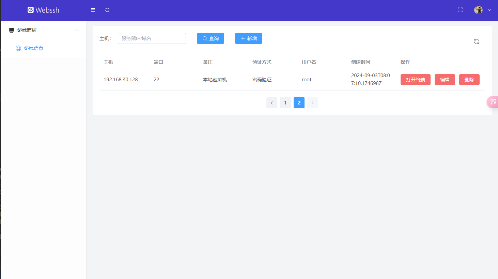
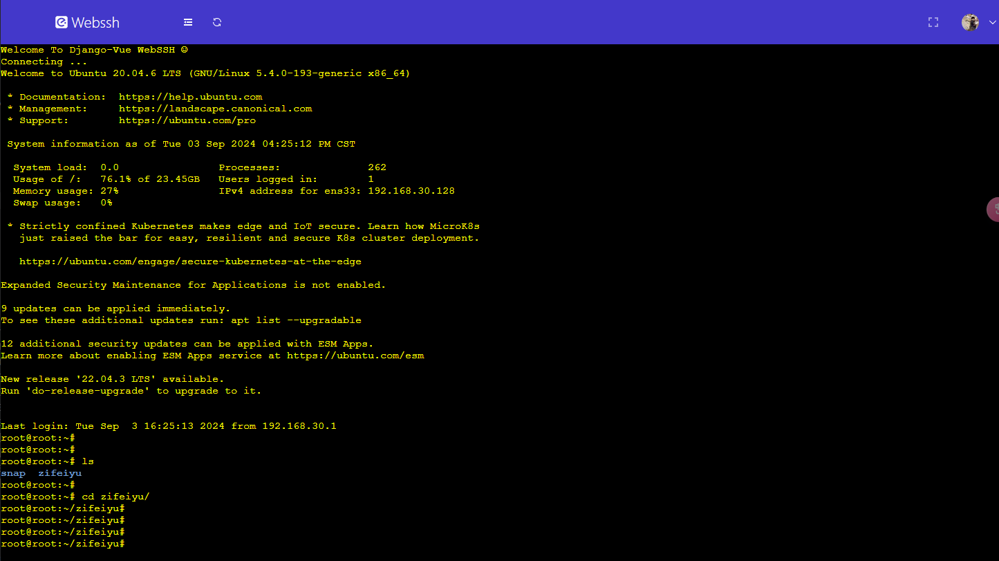

## webssh

### 之前就想着搞一个webssh的

### 这个本来是在其他系统中写的，但是因为那个写的太乱了，所以我单独把这个webssh拆出来了，这样简洁一点

### 实现功能：

- 添加主机设备
- 删除主机设备
- 条件筛选设备
- 更新主机设备
- 进入webssh界面

## 效果展示





## 后端运行：

### 1.创建虚拟环境

```shell
python -m venv venv
```

### 2.激活虚拟环境

```shell
cd /venv/Script

./activate
```

### 3.安装依赖包

```shell
pip install -r requirements.txt -i https://pypi.tuna.tsinghua.edu.cn/simple
```

### 4.数据库配置和迁移

```shell
其实这个模块我拆出来之后，使用的是sqlite3数据库，按理来说，你如果直接下载我的项目的话，项目里面有db.sqlite3这个文件的话就可以忽略这一步
但是————————————————————
如果你想自己配置mysql的话，就需要自己修改backend下setting.py文件，将database修改为自己的mysql数据库配置
然后进行数据迁移
python manage.py makemigrations
python manage.py migrate
```

### 5.运行

```shell
python manage.py runserver 8080
```

### 6.运行websocket

```shell
如果你要使用打开终端功能的话，这一步必须要打开
终端运行：
daphne -p 8001 backend.asgi:application
```

## 前端运行：

### 1.安装依赖

```shell
npm install
```

### 2.运行

```shell
npm run dev
```


